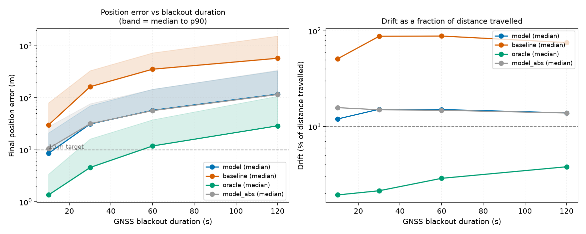
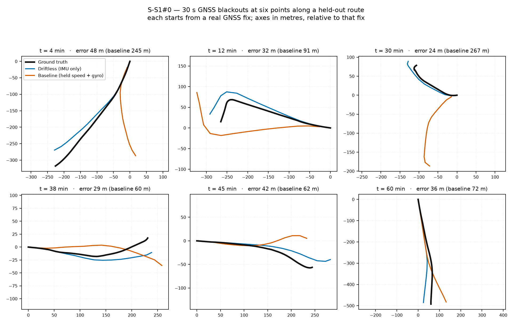
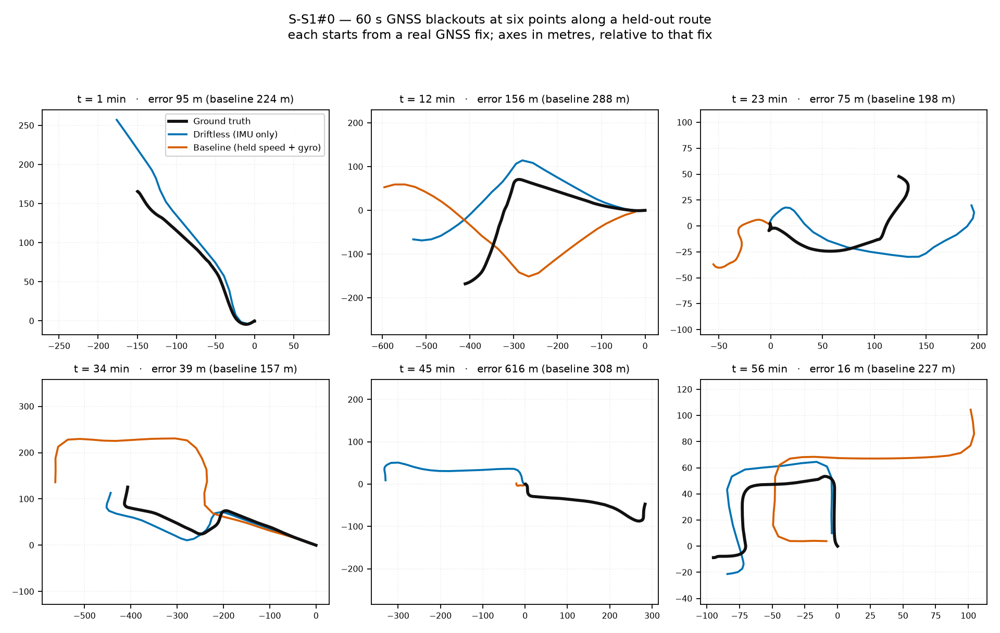
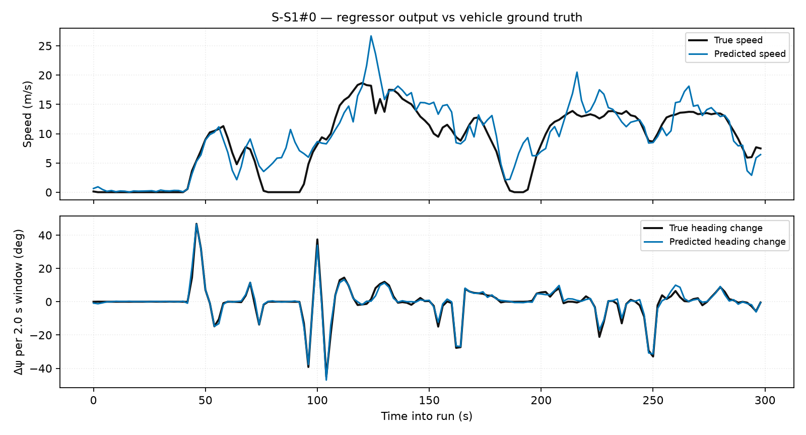
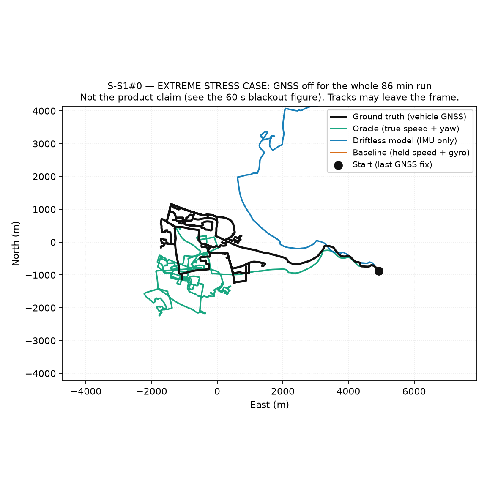

# Driftless — Round 1 evidence

SIH 2026 · PS #26168 (ISRO) · role 03 (data + model training)
Generated 2026-09-01 from the artifacts in this repo.

## 1. What was built

A speed & heading-change regressor trained on the public **IO-VNBD** dataset, evaluated by **dead reckoning through simulated GNSS blackouts** on held-out routes, and exported for both target runtimes.

## 2. Data

- **51 runs**, **27.96 h**, **1268.8 km** of paired phone-IMU + vehicle-ground-truth driving.
- Route families: M, S, Vf, Vta, Vtb, Vw, Y.
- Feature channels (14): `acc_x`, `acc_y`, `acc_z`, `gyro_yaw`, `gyro_pitch`, `gyro_roll`, `grav_x`, `grav_y`, `grav_z`, `acc_norm`, `acc_vert`, `acc_horiz`, `gyro_vert`, `gyro_horiz`.
- Ground truth is the paired vehicle file (survey GNSS at 7 decimal places, CAN velocity, wheel speeds, yaw rate) at a genuine 10 Hz. The phone's own GNSS updates only every 9 s and is unusable as a per-window label.

Sanity check on the ground truth itself: integrating the **true** speed and heading reproduces the **true** trajectory to **0.212 % drift over 38.07 km**. That validates units, the compass convention and target coherence together, and sets the floor any model is measured against.

Full per-run inventory: `artifacts/metrics/dataset_audit.md`.

## 3. Split discipline

Splits are **route-wise and duration-balanced**, frozen to `configs/splits.json`. Windows from one drive never straddle train and test — otherwise the model can memorise a road instead of learning vehicle dynamics.

Routes are additionally separated by **phone/vehicle coupling**. Only rigidly-coupled routes may appear in val or test; weakly-coupled ones are train-only and excluded from the reported model (see the coupling section of the README). The hours below are trusted data; the 70/15/15 target applies to it.

| Split | Trusted routes | Trusted hours | Route IDs |
|---|---|---|---|
| train | 10 | 9.70 | M/M (Driver B), S/S2, S/S3a, S/S3b, S/S3c, Vta/Vta02, Vta/Vta24, Vta/Vta25, Vw/Vw05, Y/Y1 |
| val | 1 | 2.53 | S/S4 |
| test | 1 | 1.44 | S/S1 |

Plus 35 weakly-coupled train-only routes (14.29 h), not used by the reported model.

## 4. Results — position error after a GNSS blackout

Held-out **test** split, 1 run(s). Context 8.0 s, output interval 2.0 s. Blackout start points every 10 s across each run; each row aggregates all of them.

- **model** — the regressor, with speed propagated from the last known fix and blended toward the absolute head (ramp τ = 20.0 s)
- **abs-only** — the absolute speed head alone, no propagation
- **baseline** — no ML: hold the last known speed, integrate the phone gyro for heading
- **oracle** — integrate the *true* speed and yaw: the dead-reckoning floor

| Blackout | n | model median (m) | model p90 (m) | model drift | abs-only (m) | baseline (m) | baseline drift | oracle (m) |
|---|---|---|---|---|---|---|---|---|
| 10 s | 489 | **8.6** | 21.2 | 12.0 % | 10.6 | 30.1 | 51.0 % | 1.4 |
| 30 s | 507 | **31.4** | 70.4 | 15.2 % | 31.8 | 163.5 | 87.9 % | 4.6 |
| 60 s | 508 | **57.5** | 146.4 | 15.1 % | 56.7 | 354.7 | 88.3 % | 11.9 |
| 120 s | 502 | **117.6** | 331.0 | 13.9 % | 115.7 | 574.9 | 75.5 % | 29.0 |

### Per-window regression accuracy

- Speed MAE **1.544 m/s**
- Heading-change MAE **1.070°** per 2.0 s window
- Same heading by raw gyro integration alone: **15.708°** — the learned head is 14.7× better

Raw per-blackout records: `artifacts/metrics/eval_blackouts.csv`.

### Cross-validated — how representative was that one road?

The table above holds out **one route**. To find out whether it was a lucky one, `crossval.py` runs **5-fold route-wise cross-validation** over the **12 trusted routes** (13.664 h): each is held out in turn by a model trained through the same `train.fit`, and the errors are pooled. 11 of 12 yield blackout samples (Vta/Vta25 is shorter than the shortest blackout, so it contributes training data only).

| Blackout | n | CV median | CV p90 | drift | baseline | oracle |
|---|---|---|---|---|---|---|
| 10 s | 4471 | **11.18 m** | 29.3 m | 13.2 % | 28.66 m | 1.5 m |
| 30 s | 4659 | **42.09 m** | 118.41 m | 18.3 % | 163.46 m | 6.21 m |
| 60 s | 4665 | **88.17 m** | 256.01 m | 18.9 % | 365.7 m | 17.85 m |
| 120 s | 4587 | **191.74 m** | 559.22 m | 19.7 % | 727.02 m | 50.45 m |

Fold-to-fold spread at 30 s: **42.244 ± 5.243 m** (range 35.7–49.25 m). Speed MAE **2.242 ± 0.349 m/s**.

**Read this before quoting the headline.** The pooled 30 s median is **42.09 m** against **31.39 m** on the single test route — 1.34× worse. Cross-validated on its own, the shipped test route **S/S1** is the easiest of the 11 evaluated routes at 30 s (32.45 m, against a per-route median of 43.94 m), so the single-split figure is the optimistic end of this model's range rather than its centre. Two effects are mixed in and 12 routes cannot fully separate them: fold models train on ~3/5 of the trusted pool, which pushes their error up, and the test route is genuinely easier, which pushes the single-split figure down. We quote both numbers everywhere and lead with the cross-validated one.

Per-route figures are in `artifacts/metrics/crossval.md`; the raw samples are in `crossval_samples.csv`.

## 5. Robustness: the phone is not lying flat in a car

Every phone in IO-VNBD lay flat (mean accelerometer direction ≈ (0, 0, 1) in all runs), but the product puts one in a dashboard mount at an arbitrary angle. Nine of the fourteen input channels are raw body axes and leave the training distribution as soon as the phone is tilted. Measured under a simulated mount rotation (random azimuth, tilt up to 60°) on the held-out route:

| training | unrotated 30 s | rotated 30 s | degradation | 60 s |
|---|---|---|---|---|
| 14 ch, no augmentation | 33.8 m | **186.5 m** | **5.5×** | 70.0 m |
| 5 gravity-projected channels only | 37.5 m | 37.5 m | **1.000× — bit-identical** | 70.3 m |
| **14 ch + rotation augmentation** | **32.8 m** | 33.3 m | **1.01×** | **59.1 m** |

Untreated, the model is *worse than the no-ML baseline* once the phone is tilted. Augmentation removes that and also improves accuracy (60 s error fell 16 %), so the reported model is trained with it (`rotate_aug=True`). The 5-channel subset is retained as a fallback whose invariance is *provable* rather than empirical: a fixed mount rotation commutes with the linear gravity filter, so those channels are exactly invariant — asserted on real data in `tests/test_augment.py`.

Related correctness note: gravity is estimated with a **causal** one-pole filter. An earlier version used a centred convolution, which averaged ~10 s of future samples into the current row — breaking the causality the windowing depends on, and not something a handset could reproduce in real time.

## 6. Handover to fusion (role 02)

Full detail in `artifacts/metrics/measurement_noise.md`.

- Forward speed: sigma **2.2046 m/s**, bias **+0.485 m/s**, with a per-speed-band table since the error scales with speed.
- Speed change (`dv`): sigma **0.8471 m/s**, bias **-0.0053 m/s** — essentially unbiased, and the better-conditioned of the two speed outputs.
- Heading change: sigma **1.4537°** per 2.0 s.
- **Residuals are time-correlated**: speed lag-1 autocorrelation **0.7367**, decorrelation time **8.0 s** — the same as the context length. Feeding one measurement per 2.0 s as if independent over-informs the filter by about **2.0×** in sigma.

The measurement is the longitudinal body-velocity component — the one axis the non-holonomic constraint deliberately leaves free — so it fits the existing unscented update with no new filter code.

## 7. IMU noise characterisation

`artifacts/metrics/allan_imu_noise.md`. Overlapping Allan deviation over **4864 s** of stationary data in 106 spans, addressing the handset half of the TODO in `edge-engine/include/driftless/imu_noise.h`.

**Two of the four parameters are not identifiable from this data**, and the tool refuses to report them rather than returning a number: in the window where bias instability should make the Allan curve rise, it is still falling on every axis. The gyro white-noise fit is separately contaminated because the vehicle is stopped but the engine is idling. Fixing both needs one capture nobody has taken: phone flat on a desk, engine off, 10 minutes at the fastest sensor rate.

## 8. Figures

### `plots/blackout_error.png`



*Position error and drift against blackout duration, model vs baseline vs oracle.*

### `plots/blackouts30_S-S1_0.png`



### `plots/blackouts60_S-S1_0.png`



### `plots/speed_S-S1_0.png`



*Regressor output vs vehicle ground truth on S-S1#0.*

### `plots/traj_S-S1_0.png`



*Dead reckoning on S-S1#0 with GNSS off for the entire run — no position updates after the start point.*

## 9. Deployment artefacts

- **38,499 parameters**, input `[1, 14, 80]`, outputs `speed_ms, dpsi_rad, dv_ms` in SI units.
- **ONNX** (C++ edge engine, roles 04–05): 123.4 KB, matches PyTorch to **2.27e-06** relative on real windows, **0.1206 ms/window** on CPU.
- **TFLite** (Android app, role 01): 182.3 KB, matches PyTorch to **1.51e-06** relative.

Normalisation is baked into both graphs, so the phone and the C++ engine cannot disagree with training about scaling.

## 10. Honest limitations

- **The regressor alone does not reach the <10 m at 30 s target.** It reaches roughly that at a 10 s blackout; at 30 s the residual is dominated by absolute-speed error, which is the fundamentally hard part of inertial-only odometry. Closing the rest is what the road-network constraint (map matching) and the EKF in role 02 are for — a vehicle on a known road cannot be anywhere the map does not allow.
- Trained on IO-VNBD: UK/France/Nigeria, one phone, one vehicle. Indian roads and other handsets are the fine-tuning step the roadmap already sequences (pre-train public → fine-tune own captures).
- IO-VNBD phone data is 10 Hz; our own captures target 100 Hz. The window is defined in seconds, so the design carries over — but it needs retraining, not just reuse.
- Ground truth is the vehicle's own CAN + survey GNSS, so labels inherit its ~0.2 % self-consistency floor.

## 11. Reproducing these numbers

```bash
cd training
export PYTHONPATH=.
python -m driftless_train.download    # LFS-aware, both S and V sides
python -m driftless_train.audit       # per-run inventory
python -m driftless_train.prepare     # pair S with V, materialise arrays
python -m driftless_train.train --epochs 40
python -m driftless_train.evaluate --split val --sweep-alpha  # tune blend
python -m driftless_train.evaluate --split test               # numbers
python -m driftless_train.export
python -m driftless_train.report
pytest tests/ -q                      # pins every dataset trap
```
